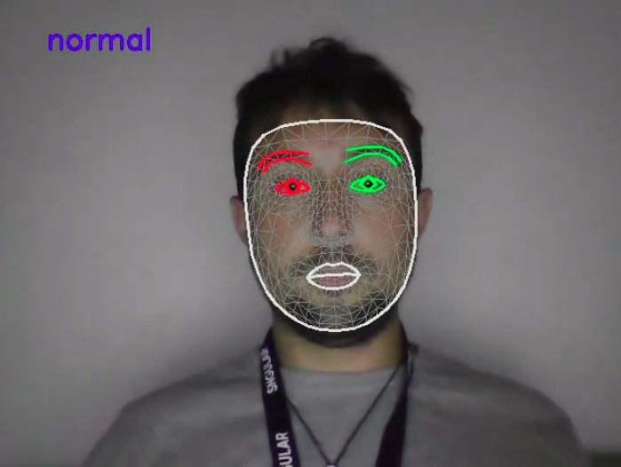
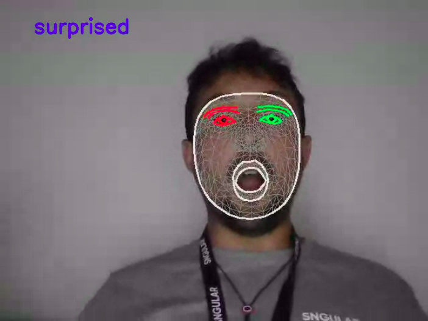
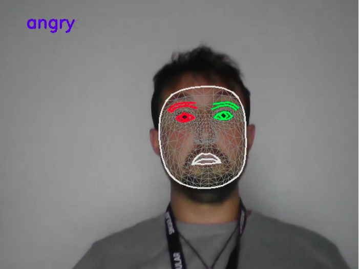
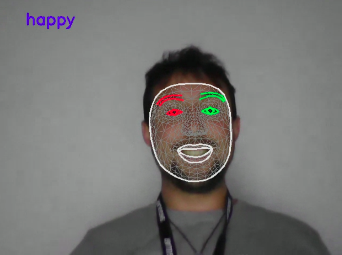
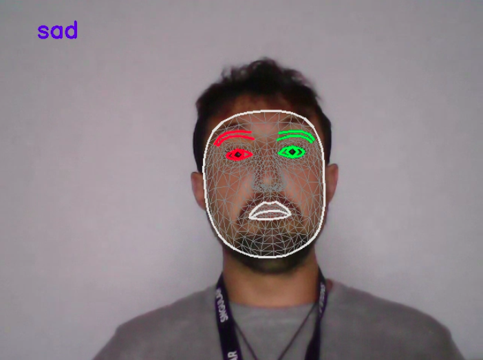
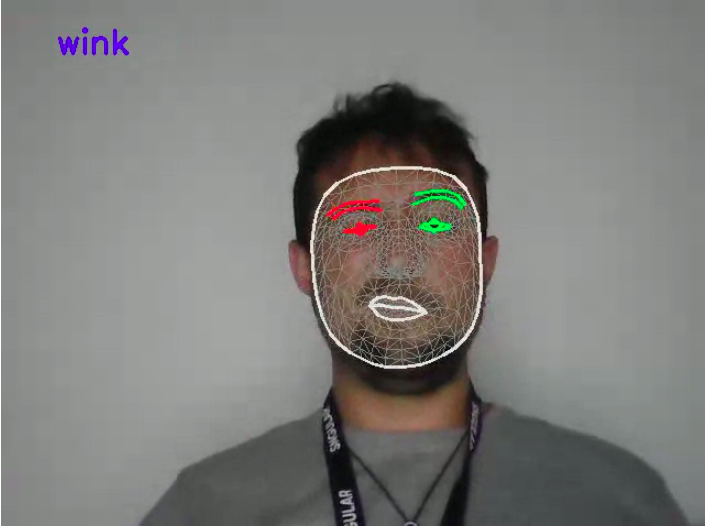

# 👋 Welcome to the face analysis project

## 📜 Table of contents

- [👋 Welcome to the face analysis project](#-welcome-to-the-face-analysis-project)
  - [📜 Table of contents](#-table-of-contents)
  - [😃 Description](#-description)
  - [👷 How to use](#-how-to-use)
    - [🐋 Using docker](#-using-docker)
    - [🐍 Using python](#-using-python)

## 😃 Description

This project aims to **predict face expressions** (happyness, rage, sadness...) by using a combination of deep learning and machine learning models.

| Normal | Surprise | Angry | Happy | Sad | Wink |
|----------|-------------|------|----------|----------|----------|
|  |   |  |  |  |  |

## 👷 How to use

### 🐋 Using docker

```shell
docker-compose up -d --build
```

### 🐍 Using python

```shell
pip install -r requirements.txt
streamlit run app/main.py
```
